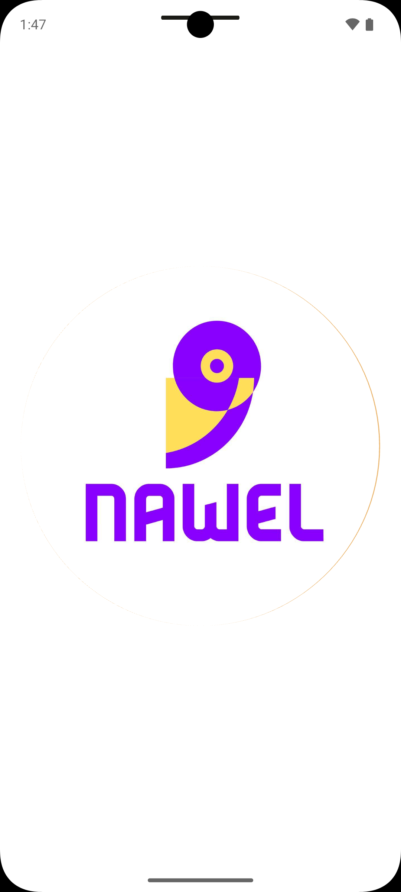

## Frameworks & Languages
  <a></a>
  <a></a>
  <a></a>
  <a></a>
  <a></a>
  <a></a>
  <a></a>
  <a></a>


## Getting Started
✅ Features

  -Clean Architecture — ensures scalability and maintainability with clear separation of concerns.
    
  -BLoC State Management — uses Bloc and the copyWith pattern for immutable and predictable state updates.
  
  -Supabase Integration:
   Authentication: user sign up & sign in with email and password.

  -Database: stores user information (name, email, profile image URL).

  -Storage: uploads and retrieves user profile images.

  -Local Storage with Hive — caches the username locally for offline access.


### Dependencies

* cupertino_icons: ^1.0.8
* dartz: ^0.10.1
* device_preview: ^1.2.0
* dio: ^5.8.0+1
* flutter:
* sdk: flutter
* flutter_bloc: ^9.1.1
* flutter_screenutil: ^5.9.3
* get_it: ^8.0.3
* go_router: ^15.2.0
* hive: ^2.2.3
* hive_flutter: ^1.1.0
* image_picker: ^1.1.2
* modal_progress_hud_nsn: ^0.5.1
* smooth_page_indicator: ^1.2.1
* supabase_flutter: ^2.9.1


### Installing

1. Open Terminal and Clone the Repo
```
  git clone https://github.com/mohamedatef04/AUVNET-Flutter-Internship-Assessment.git
```

2. Cd Over
```
   cd auvnet_internship_task
```

3. Run Pub
```
   Flutter pub get
```

### Download and Try The APK Android App From This path

````
[Download here](release/app-release.apk)
````


## Images
````
images
````
<div style= "display : flex ; justify-content: space-between ; margin : 20px 0px">



</div>
